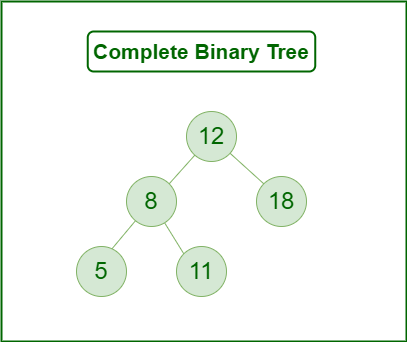
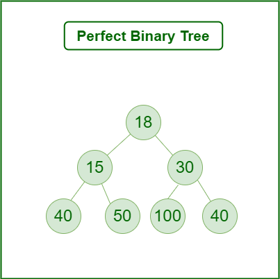
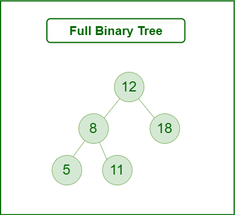

# C - Binary trees

## resources:

1- youtube
2- https://www.geeksforgeeks.org/binary-tree-data-structure/#Introduction

## General

> What is a binary tree

> What is the difference between a binary tree and a Binary Search Tree

> What is the possible gain in terms of time complexity compared to linked lists

> What are the depth, the height, the size of a binary tree

> What are the different traversal methods to go through a binary tree

> What is a complete, a full, a perfect, a balanced binary tree

A binary tree is a hierarchical data structure used in computer science to represent a collection of nodes connected by edges. It's called a "binary" tree because each node in the tree can have at most two children, which are typically referred to as the left child and the right child. These children themselves are binary trees, creating a recursive structure.

The binary tree is characterized by the following properties:

> 1.  **Root Node:** The topmost node in the tree is called the root node. It serves as the starting point for traversing the tree.

> 2.  **Node:** Each element in the tree is called a node. Each node contains a value and can have up to two children.

> 3.  **Children:** A node can have zero, one, or two children. A node with no children is called a leaf node, while nodes with at least one child are called internal nodes.

> 4.  **Parent:** A node in the tree can have a parent node, except for the root node, which has no parent.

> 5.  **Sibling:** Nodes that share the same parent are called siblings.

> 6.  **Depth:** The depth of a node is the length of the path from the root node to that node. The depth of the root node is 0, and the depth of other nodes is the depth of their parent plus 1.

> 7.  **Height (or Depth of the Tree):** The height of a binary tree is the length of the longest path from the root node to a leaf node. It represents the maximum number of edges that need to be traversed to reach a leaf from the root.

---

the main difference between a binary tree and a Binary Search Tree lies in the ordering of the elements within the tree. A binary tree doesn't impose any ordering on its elements, while a Binary Search Tree enforces a specific ordering that facilitates efficient data manipulation operations.

---

Binary Search Trees (BSTs) offer significant advantages in terms of time complexity compared to linked lists:

1. **Search Efficiency:** In BST, search have a time complexity of O(log n), where n is the number of nodes. This is faster than the O(n) time complexity of linked lists

2. **Insertion and Deletion:** Insertion and deletion in BSTs also take O(log n) time on average. In linked lists, insertion or deletion at takes O(n).

---

> 1.  **Depth:**
>     The depth of a node in a binary tree is the distance from the root node to that particular node.
> 2.  **Height (also known as the Depth of the Tree):**
>     The height of a binary tree is the length of the longest path from the root node to any leaf node in the tree.
> 3.  **Size (also known as the Number of Nodes):**
>     The size of a binary tree is the total count of nodes present in the tree.

---

> 1.  **Complete Binary Tree**
>     A Binary Tree is a Complete Binary Tree if all the levels are completely filled except possibly the last level and the last level has all keys as left as possible.

> 2.  **Perfect Binary Tree**
>     A Binary tree is a Perfect Binary Tree in which all the internal nodes have two children and all leaf nodes are at the same level.

> 3.  **Balanced Binary Tree**
>     A binary tree is balanced if the height of the tree is O(Log n) where n is the number of nodes

> 1.  **Full Binary Tree**
>     A Binary Tree is a full binary tree if every node has 0 or 2 children.

## 

---

**max numeber of nodes at a level** = $2^{Level}$

**max numeber of nodes in a Binary tree** = $2^{height+1} - 1$

**height of the tree** = $log2(n+1)-1$

---

**pre-order**: root left right

**in-order**: left root right

**post-order**: left right root
